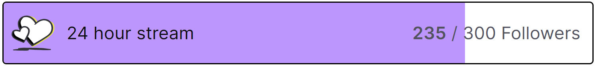
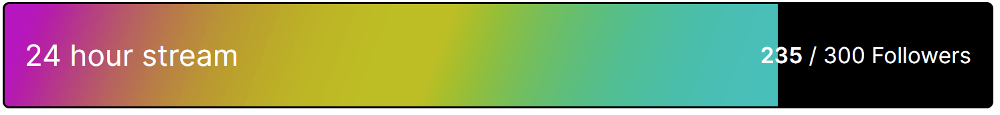

# twitch-goal-customization
Customize twitch goal

## Before

## After

## how to use
Copy custom.css and put it in your override for your browser source. You can change the image/colors there as well.